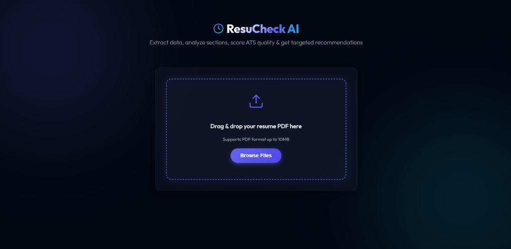

# ResuCheck AI - Advanced Resume Screener & ATS Optimizer



ResuCheck AI is a premium, fully-functional web application designed to simplify the resume screening process for both recruiters and job seekers. It parses PDF resumes, scores formatting and completeness against standard ATS constraints, classifies professional domains, and suggests matching skills/courses to improve candidate profiles.

---

## Key Features
- **Drag-and-Drop Uploader**: Modern front-end drop zone styled with a premium dark glassmorphism design.
- **ATS Score Gauge**: Circular animated SVG indicator providing a compatibility score out of 100.
- **Profile Overview**: Extracts key details including Candidate Name, Email, Phone, College, and Degree.
- **Classified Track**: Automatically matches skills to professional profiles (e.g. Software Developer, Data Scientist).
- **Checks Checklist**: Verifies presence of crucial sections (Education, Projects, Hobbies, etc.).
- **Smart Recommendations**: Suggests missing skills and highlights targeted Coursera/Udemy-like training courses.

---

## Quick Start Guide

Follow these steps to run the application on your local machine:

### 1. Set Up a Virtual Environment
Create and activate a virtual environment to keep dependencies isolated:
```powershell
# Create venv
python -m venv venv

# Activate venv (Windows)
.\venv\Scripts\activate

# Activate venv (Mac/Linux)
source venv/bin/activate
```

### 2. Install Dependencies
Install all required libraries:
```powershell
pip install -r requirements.txt
```

### 3. Download the spaCy Language Model
Download the English NLP pipeline required for entity extraction:
```powershell
python -m spacy download en_core_web_sm
```

### 4. Run the Application
Start the local Flask development server:
```powershell
python app.py
```

Open your browser and navigate to:
```url
http://127.0.0.1:5000/
```

---

## Security Best Practices Enforced
This application includes several security measures to ensure secure deployment:
- **Filename Sanitization**: Uses `secure_filename` to prevent Directory Traversal attacks (guarding against malicious filenames attempting to overwrite critical system directories).
- **Extension Validation**: Strictly rejects any non-PDF uploads, mitigating remote code execution risk.
- **File Size Protection**: Configured with a `16MB` upload size limit (`MAX_CONTENT_LENGTH`) to defend the server against denial-of-service (DoS) attempts.
